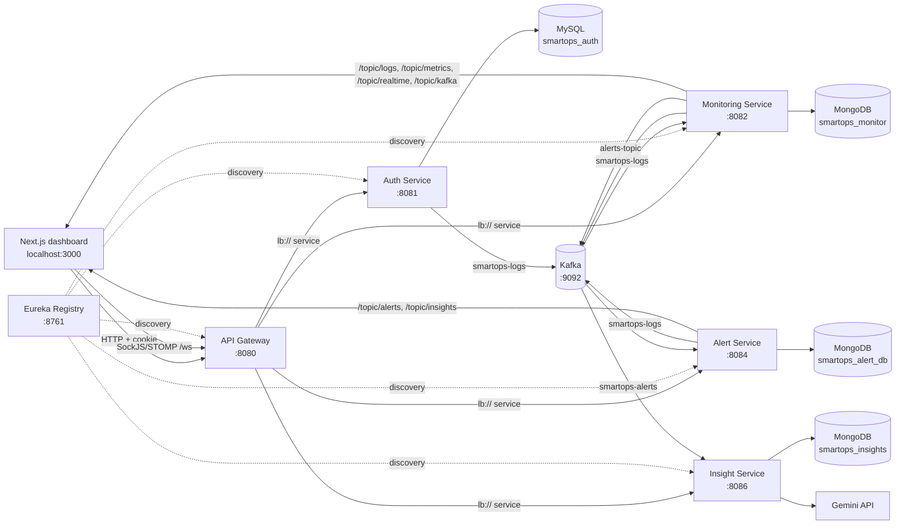

# SmartOps AI

SmartOps AI is a full-stack observability and incident-management prototype. A Next.js dashboard talks to a Spring Cloud Gateway, which routes to authentication, monitoring, alert, and insight services discovered through Eureka. MongoDB stores operational data, MySQL stores users, Kafka carries log/alert events, and Gemini is used by the insight service for AI-generated incident analysis.

> **Repository-grounded note:** This README describes the code currently in the repository. It does not imply production guarantees that are not implemented. In particular, the supplied Docker Compose file starts only Kafka and ZooKeeper; the databases and application services are run separately.

## Contents

- [Overview](#overview)
- [Technology stack](#technology-stack)
- [Architecture](#architecture)
- [Service responsibilities](#service-responsibilities)
- [Request and event flows](#request-and-event-flows)
- [Authentication, JWT, and ownership isolation](#authentication-jwt-and-ownership-isolation)
- [Kafka event flows](#kafka-event-flows)
- [Monitoring, alerts, insights, and WebSocket](#monitoring-alerts-insights-and-websocket)
- [Data model and persistence](#data-model-and-persistence)
- [HTTP API](#http-api)
- [Important classes and methods](#important-classes-and-methods)
- [Setup and configuration](#setup-and-configuration)
- [Failure behavior and operational caveats](#failure-behavior-and-operational-caveats)
- [Security](#security)
- [Testing](#testing)
- [Known limitations and production improvements](#known-limitations-and-production-improvements)
- [Interview questions and answers](#interview-questions-and-answers)
- [Summary](#summary)

## Overview

The product has two complementary paths:

1. **Synchronous dashboard path:** the browser sends cookie-authenticated HTTP requests to the gateway. The gateway validates the JWT and forwards requests to a service selected by Eureka.
2. **Asynchronous operations path:** logs and alerts are published to Kafka. Consumers persist them and broadcast selected updates over STOMP/SockJS WebSockets. Alert events are also consumed by the insight service, which calls Gemini and persists the resulting insight.

The dashboard exposes login/registration, service inventory, live logs, alerts, analytics, AI insights, profile, and settings pages. The root page redirects to `/dashboard`; protected pages are wrapped by the client-side protected layout.

## Technology stack

| Area | Actual implementation |
|---|---|
| Backend | Java, Spring Boot 3.5.x parent in the individual Maven modules |
| API edge | Spring Cloud Gateway (WebFlux), Eureka client-side load balancing |
| Discovery | Spring Cloud Netflix Eureka server on port `8761` |
| Auth | Spring Security, JJWT, HttpOnly `token` cookie, gateway filter |
| Messaging | Apache Kafka with Confluent Platform `7.5.0` Compose images and ZooKeeper |
| Operational persistence | Spring Data MongoDB (separate database names per service) |
| User persistence | Spring Data JPA/Hibernate with MySQL |
| Live updates | Spring WebSocket/STOMP with SockJS; simple in-memory broker |
| AI | Gemini API client in `insight-service` (`GEMINI_API_KEY` is read from the environment) |
| Frontend | Next.js `^16.2.6`, React `^19`, TypeScript `5.7.3` |
| UI/data | Tailwind CSS, Radix UI, Recharts, Framer Motion, Axios, `@stomp/stompjs`, `sockjs-client` |
| Build | Maven multi-module backend; npm scripts in `smartops-dashboard` |

The repository root Maven POM declares the modules `common`, `auth-service`, `monitoring-service`, `alert-service`, `api-gateway`, `service-registry` (the root POM currently lists `common` twice; see limitations). `insight-service` has its own POM but is not listed in the root module list.

## Architecture



### Ports and service names

| Component | Port | Spring application name / role |
|---|---:|---|
| Service registry | 8761 | `service-registry` |
| API gateway | 8080 | `api-gateway` |
| Auth | 8081 | `AUTH-SERVICE` |
| Monitoring | 8082 | `monitoring-service` |
| Alert | 8084 | `alert-service` |
| Insight | 8086 | `INSIGHT-SERVICE` |
| Dashboard | 3000 (Next default) | `smartops-dashboard` |
| Kafka | 9092 | local broker |
| ZooKeeper | 2181 | Kafka coordination |
| MySQL | 3306 (expected by auth config) | `smartops_auth` |
| MongoDB | 27017 (expected by service configs) | service-specific databases |

## Service responsibilities

### `service-registry`
Runs the Eureka server. It does not register with or fetch from another Eureka server.

### `api-gateway`
Runs on port 8080, discovers backend services through Eureka, applies `JwtGatewayFilter`, injects identity headers for downstream services, and configures global CORS. Routes cover `/api/auth/**`, `/api/monitor/**`, `/api/logs/**`, `/api/alerts/**`, `/api/insights/**`, `/ws/**`, and monitoring SockJS/WebSocket traffic under `/monitor-ws/**`. Kafka is intentionally not a gateway dependency; the gateway performs routing and JWT handling only.

### `auth-service`
Owns registration, login/logout, current-user lookup, user settings, profile updates, and password changes. `User` is a JPA entity in MySQL. Login creates a JWT and sets an HttpOnly `token` cookie; logout expires that cookie. It also has a Kafka producer for log events.

### `monitoring-service`
Owns monitored `ServiceStatus` records, health checks, performance metrics, uptime, dashboard aggregates, log queries, and Kafka metrics. It consumes `smartops-logs`, stores `LogDocument` in MongoDB, and broadcasts saved logs to `/topic/logs`. Its scheduled monitor runs at the configured polling interval (the property is `monitoring.polling-rate=30000`, i.e. intended as 30 seconds).

### `alert-service`
Owns MongoDB `Alert` records and alert statistics. It creates, lists, acknowledges, resolves, and deletes alerts; alert mutations broadcast `/topic/alerts` (deletion uses `/topic/alerts/delete`). It consumes `alerts-topic`. It also exposes a lightweight `/api/insights` reader for its local `Insight` model and publishes insight updates to `/topic/insights`.

### `insight-service`
Consumes alert events from Kafka, calls Gemini through `GeminiService`, parses/stores `Insight` documents in MongoDB, and exposes insight CRUD/read endpoints. `/api/insights/gemini-test` is a live integration test endpoint that sends a fixed sample incident to Gemini.

### `common`
Contains shared Kafka event DTOs: `LogEvent` (`serviceName`, `level`, `message`, `timestamp`) and `AlertEvent` (`serviceName`, `severity`, `message`, `timestamp`, `status`).

## Request and event flows

### Login and authenticated dashboard request

1. The browser posts credentials to `/api/auth/login` through Axios (`withCredentials: true`).
2. Auth validates the user and returns a response while setting the HttpOnly `token` cookie.
3. A subsequent request reaches the gateway. `JwtGatewayFilter` extracts and validates the cookie, then forwards identity in `X-User-Id` (and related headers as implemented).
4. Eureka load-balances the request to the target service.
5. The dashboard calls `/api/auth/me` to hydrate `AuthContext`; protected pages render only after that check completes.

### Service monitoring

1. A user creates a monitored service with `POST /api/monitor/services`.
2. The monitoring service persists `ServiceStatus` with the supplied user identity.
3. The scheduled monitor and explicit `/api/monitor/check` path perform service checks and update status/metrics.
4. Dashboard pages fetch service health, metrics, logs, uptime, dashboard aggregates, and realtime metrics.

### Log ingestion and live display

1. A producer emits a `LogEvent` to `smartops-logs`.
2. `monitoring-service` consumes it with `KafkaConsumerService`.
3. `LogService` stores a `LogDocument` in MongoDB.
4. `WebSocketLogService` publishes the saved log to `/topic/logs`.
5. `smartops-dashboard/service/websocket.ts` subscribes through SockJS/STOMP and passes parsed messages to the live-log UI.

### Alert-to-insight

1. Monitoring or another producer sends an `AlertEvent` to `alerts-topic`.
2. `alert-service` consumes and persists an alert. The repository also contains an `InsightKafkaConsumer` for `smartops-alerts`, but no producer for that exact topic is visible in the checked-in source.
3. `insight-service` consumes the alert event, builds a prompt, and calls Gemini.
4. The structured result is saved as an `Insight` and made available through `/api/insights`.

## Authentication, JWT, and ownership isolation

- `AuthController` exposes registration, login, logout, `/me`, settings, and profile-related operations.
- `JwtUtil` creates and verifies signed JWTs. The auth service reads its signing configuration from `jwt.secret`; the actual configured value is intentionally not reproduced here.
- The login cookie is named `token`, is HttpOnly, path `/`, and currently has a one-hour max age. The source sets `Secure=false` for local HTTP; production must use HTTPS and `Secure=true`.
- The gateway validates the cookie before forwarding protected requests and supplies `X-User-Id` for downstream ownership checks.
- Monitoring service methods such as `getServicesByUser`, `addService`, `updateService`, and `deleteService` use the user ID. Dashboard/health/realtime methods also accept `X-User-Id`.
- **Important boundary:** several read endpoints (`/services/{serviceId}`, health, metrics, logs, uptime; alert and global log endpoints) do not show an ownership header in their controller signatures. The implementation therefore does not provide uniform resource-level isolation for every endpoint. The gateway header is not a substitute for an authorization check in each service.
- The frontend relies on cookies and does not place a bearer token in JavaScript or local storage.

## Kafka event flows

| Topic | Producer(s) in source | Consumer(s) in source | Payload / purpose |
|---|---|---|---|
| `smartops-logs` | Auth, monitoring, and other domain producers | Monitoring (`KafkaConsumerService`) | `LogEvent`; persistence and live log broadcast |
| `alerts-topic` | Monitoring (`KafkaProducerService`) | Alert (`AlertKafkaConsumer`) | `AlertEvent`; create/update operational alerts |
| `smartops-alerts` | No producer found in the checked-in source | Insight (`InsightKafkaConsumer`) | alert event expected to trigger AI analysis |

Kafka is configured for local `localhost:9092` with JSON serializers/deserializers. Consumers use `earliest` in services that configure it and fixed groups such as `monitor-group`, `alert-group`, and `insight-group`. The Compose broker uses replication factor `1`, suitable only for development.

## Monitoring, alerts, insights, and WebSocket

- **Metrics:** `MonitoringServiceImpl` computes dashboard, system-health, realtime, Kafka, service metrics, and uptime responses. It broadcasts metrics on `/topic/metrics`, `/topic/realtime`, and `/topic/kafka`.
- **Alerts:** `AlertServiceImpl` manages `AlertStatus` and `AlertSeverity`, publishes alert updates, and exposes active/critical/statistics views.
- **AI insights:** `GeminiService` is called by the insight consumer and by `/api/insights/gemini-test`; `InsightService` persists and retrieves insight documents.
- **WebSocket:** both monitoring and alert services register `/ws` SockJS endpoints with permissive `allowedOriginPatterns("*")` and simple brokers. The gateway proxies `/ws/**` to alert service, while the dashboard hardcodes `http://localhost:8080/ws` and subscribes to `/topic/logs`. This is a notable deployment/ownership mismatch: the log broker is implemented in monitoring-service, but the gateway's `/ws` route points at alert-service.
- **Frontend:** hooks such as `use-alerts`, `use-dashboard`, `use-insights`, `use-logs`, `use-services`, and `use-notification` wrap API/WebSocket behavior; pages render cards, charts, alert panels, logs, and insight views.

## Data model and persistence

| Store | Collections/table | Main model | Notes |
|---|---|---|---|
| MySQL | `users` (JPA-managed schema) | `com.smartops.auth.model.User` | user identity, role, password and settings fields; `Role` is the role model |
| MongoDB `smartops_monitor` | service-status and log collections | `ServiceStatus`, `LogDocument` | monitored services, health/metrics state, and consumed logs |
| MongoDB `smartops_alert_db` | `alerts` plus alert-service insights | `Alert`, `Insight` | alert lifecycle and alert-facing insight reads |
| MongoDB `smartops_insights` | insights | `com.smartops.insightservice.model.Insight` | AI-generated incident analysis |

Repositories include `UserRepo`, `ServiceStatusRepository`, `LogRepository`, `AlertRepository`, and `InsightRepository`. Mongo services use Spring Data MongoDB; auth uses Hibernate with `spring.jpa.hibernate.ddl-auto=update`.

## HTTP API

All paths below are intended to be called through `http://localhost:8080`. Do not copy credentials or tokens into scripts or documentation.

### Authentication and profile (`auth-service`)

| Method | Path | Behavior |
|---|---|---|
| `POST` | `/api/auth/register` | Register a user from `RegisterRequest`. |
| `POST` | `/api/auth/login` | Validate `LoginRequest`; sets the HttpOnly `token` cookie. |
| `POST` | `/api/auth/logout` | Expires the token cookie. |
| `GET` | `/api/auth/me` | Resolve current user from `X-User-Id`. |
| `GET` | `/api/auth/settings` | Get settings for `X-User-Id`. |
| `PUT` | `/api/auth/settings` | Update settings. |
| `GET` | `/api/auth/profile` | Read profile for `X-User-Id`. |
| `PUT` | `/api/auth/profile` | Update profile. |
| `PUT` | `/api/auth/profile/change-password` | Change password. |

### Monitoring and logs (`monitoring-service`)

| Method | Path | Behavior |
|---|---|---|
| `POST` | `/api/monitor/services` | Add a monitored service; requires `X-User-Id`. |
| `GET` | `/api/monitor/services` | List the caller's services. |
| `GET` | `/api/monitor/services/{serviceId}` | Read one service. |
| `PUT` | `/api/monitor/services/{id}` | Update a service; requires `X-User-Id`. |
| `DELETE` | `/api/monitor/services/{id}` | Delete a service; requires `X-User-Id`. |
| `GET` | `/api/monitor/services/{serviceId}/health` | Read service health. |
| `GET` | `/api/monitor/services/{serviceId}/metrics?timeRange=hour` | Read performance metrics. |
| `GET` | `/api/monitor/services/{serviceId}/logs?limit=100` | Read service logs. |
| `GET` | `/api/monitor/services/{serviceId}/uptime` | Read uptime data. |
| `GET` | `/api/monitor/dashboard` | User-filtered dashboard metrics. |
| `GET` | `/api/monitor/health` | User-filtered system health. |
| `GET` | `/api/monitor/realtime` | User-filtered realtime metrics. |
| `GET` | `/api/monitor/kafka` | Kafka metrics. |
| `GET` | `/api/monitor/check` | Manually trigger monitoring; debug-oriented endpoint. |
| `GET` | `/api/monitor/metrics/{type}?timeRange=day` | User-filtered metrics by type. |
| `GET` | `/api/logs` | All stored logs. |
| `GET` | `/api/logs/recent?limit=100` | Recent logs. |
| `GET` | `/api/logs/service/{serviceName}?limit=50` | Logs for a service. |
| `GET` | `/api/logs/level?level=INFO` | Logs by level. |
| `GET` | `/api/logs/search?query=...&limit=50` | Search logs. |
| `GET` | `/api/logs/stats` | Log statistics. |

### Alerts (`alert-service`)

| Method | Path | Behavior |
|---|---|---|
| `POST` | `/api/alerts` | Create a validated alert. |
| `GET` | `/api/alerts` | List alerts. |
| `GET` | `/api/alerts/active` | List active alerts. |
| `GET` | `/api/alerts/critical` | List critical alerts. |
| `GET` | `/api/alerts/stats` | Alert statistics. |
| `GET` | `/api/alerts/{id}` | Read an alert. |
| `PUT` | `/api/alerts/{id}/acknowledge` | Acknowledge an alert. |
| `PUT` | `/api/alerts/{id}/resolve` | Resolve an alert. |
| `DELETE` | `/api/alerts/{id}` | Delete an alert. |
| `GET` | `/api/insights` | Alert-service insight list. |

### Insights (`insight-service`)

| Method | Path | Behavior |
|---|---|---|
| `GET` | `/api/insights` | List insight-service documents. |
| `GET` | `/api/insights/{id}` | Get an insight. |
| `DELETE` | `/api/insights/{id}` | Delete an insight. |
| `DELETE` | `/api/insights` | Delete all insights. |
| `GET` | `/api/insights/count` | Count insights. |
| `GET` | `/api/insights/test` | Return a service-up string. |
| `GET` | `/api/insights/gemini-test` | Call Gemini with a fixed sample prompt. |

> **Routing discrepancy:** the gateway declares both an alert-service and an insight-service route for `/api/insights/**`, in that order. Verify the effective route in the deployed gateway before relying on insight-service endpoints through port 8080.

## Important classes and methods

- `JwtGatewayFilter.filter`: gateway JWT validation and downstream identity propagation.
- `auth.security.JwtUtil`: token creation, parsing, expiration, and request extraction.
- `AuthServiceImpl.register/login/getCurrentUser`: user lifecycle and authentication.
- `ProfileService`: profile and password operations.
- `MonitoringServiceImpl`: service CRUD, health polling, metrics, dashboard aggregation, Kafka metrics, and scheduled monitoring.
- `KafkaConsumerService.consume`: log event persistence followed by WebSocket broadcast.
- `LogService`: log querying and statistics.
- `AlertServiceImpl`: alert lifecycle and topic publication.
- `AlertKafkaConsumer`: Kafka-to-alert conversion.
- `InsightKafkaConsumer`: alert-to-Gemini-to-Mongo pipeline.
- `GeminiService.generateInsight`: external AI call and response handling.
- `InsightService`: insight CRUD/count operations.
- `WebSocketConfig` (monitoring and alert): STOMP endpoint and broker configuration.
- Frontend `AuthProvider`/`useAuth`: cookie-backed session hydration, login, registration, logout, and redirect behavior.
- Frontend `service/api.ts`: Axios base URL, credentials, timeout, and error interceptor.
- Frontend `service/websocket.ts`: singleton SockJS/STOMP client and `/topic/logs` subscription.

## Setup and configuration

### Prerequisites

- JDK 21 (the source targets the Java 21 toolchain in the Maven modules)
- Maven 3.9+ (or each module's `mvnw`)
- Node.js and npm compatible with the Next.js package manifest
- MySQL and MongoDB running locally
- Docker Desktop/Engine for Kafka and ZooKeeper
- A Gemini API key only if using insight generation

### Start local infrastructure

The checked-in `docker-compose.yml` starts only Kafka and ZooKeeper:

```bash
docker compose up -d zookeeper kafka
```

Create the MySQL database expected by auth (`smartops_auth`) and run MongoDB on its configured local port. Do not put passwords or API keys in the README; provide them through local environment/profile configuration.

### Build and run backend modules

From each module directory, use `./mvnw spring-boot:run` (or `mvn spring-boot:run`) in this order:

```text
service-registry   :8761
api-gateway        :8080
auth-service       :8081
monitoring-service :8082
alert-service      :8084
insight-service    :8086
```

The registry should be available before clients start. Build all declared root modules with `mvn clean verify`; because `insight-service` is not currently a root module, build it separately if needed.

### Run the dashboard

```bash
cd smartops-dashboard
npm ci
npm run dev
```

The dashboard uses `NEXT_PUBLIC_API_URL` when set, otherwise `http://localhost:8080`. The WebSocket client currently uses a hardcoded `http://localhost:8080/ws`, so a non-local deployment requires a source/configuration change or compatible proxy.

### Configuration reference

| Setting | Current source default / location | Purpose |
|---|---|---|
| `server.port` | per-service properties | service ports listed above |
| `spring.datasource.url` | auth properties | MySQL JDBC URL |
| `spring.data.mongodb.uri` | monitoring/alert/insight properties | Mongo connection and database |
| `spring.kafka.bootstrap-servers` | backend properties | Kafka broker |
| `eureka.client.service-url.defaultZone` | backend properties | registry URL |
| `jwt.secret` | auth properties | JWT signing input; replace with a secret manager value |
| `gemini.api.key` | `${GEMINI_API_KEY}` | Gemini credential from environment |
| `monitoring.polling-rate` | `30000` | scheduled monitoring interval |
| `NEXT_PUBLIC_API_URL` | optional frontend env | gateway base URL |

## Failure behavior and operational caveats

- Axios has a 10-second timeout and logs non-`/api/auth/me` failures before rejecting the promise.
- `AuthProvider` treats failed session initialization as unauthenticated; logout redirects to `/login` even if the logout request fails.
- WebSocket reconnect delay is 10 seconds; malformed messages are ignored and STOMP/WebSocket errors are not surfaced to the UI.
- Kafka consumers use fixed consumer groups and JSON deserialization. There is no documented retry/DLQ strategy in the source.
- Mongo/MySQL/Kafka/Eureka outages therefore surface as request failures, consumer errors, or stale dashboard data; no circuit breaker or durable event-outbox is implemented.
- The scheduled monitor performs external health checks; slow/unreachable targets can affect polling and metric freshness.
- Actuator exposure is broad (`*`) in several services and health details are enabled. Restrict this in any non-local deployment.
- Error responses and debug logging are development-oriented (`show-sql`, Spring Security DEBUG, gateway DEBUG, and `server.error.include-message`).

## Security

Implemented: Spring Security, signed JWT validation at the gateway, HttpOnly cookie storage, password hashing through the auth service's security configuration, request validation on alert creation, and identity headers for downstream ownership-aware operations.

Do not treat the current defaults as production-safe. The source uses a local JWT configuration, disables the cookie `Secure` flag for HTTP development, allows all WebSocket origins, enables permissive gateway CORS (including credentials), exposes Actuator endpoints, and logs SQL/security details. Use HTTPS, `Secure`/`SameSite` cookie policy, a managed secret, strict origin allowlists, CSRF analysis appropriate to cookie auth, least-privilege service credentials, rate limiting, input/output redaction, and network isolation before deployment. Never commit credentials, API keys, real JWTs, Authorization headers, or private keys.

## Testing

Each backend service contains a Spring Boot context-load test such as `*ApplicationTests`. Run the available tests with:

```bash
mvn test
cd insight-service && ./mvnw test
```

The frontend package provides `npm run lint` and `npm run build`; there is no separate frontend unit-test script in `package.json`. The existing tests do not constitute end-to-end coverage for Kafka, databases, gateway routing, JWT ownership, Gemini, or WebSockets; add integration tests before making production claims.

## Known limitations and production improvements

1. **Compose scope:** add MySQL, MongoDB, Eureka, and all application services (or provide a documented Kubernetes/production deployment) with health checks and dependency readiness.
2. **Root build:** remove the duplicate `common` module declaration and decide whether `insight-service` should be a root module.
3. **Routing:** resolve the duplicate `/api/insights/**` gateway route and route `/ws` to the service that actually owns each topic, or centralize WebSocket handling.
4. **Authorization:** enforce ownership and role checks for every service/alert/log/insight read and mutation, not only methods that accept `X-User-Id`.
5. **Secrets:** externalize the JWT signing key and database credentials, rotate keys, and use a secret manager.
6. **Web security:** use HTTPS, strict CORS, secure SameSite cookies, CSRF protection appropriate to the chosen cookie strategy, and authenticated WebSocket handshakes.
7. **Resilience:** add timeouts/circuit breakers, Kafka retry/DLQ/idempotency, transactional outbox where required, and graceful readiness/liveness handling.
8. **Observability:** replace ad-hoc metrics with Micrometer/OpenTelemetry, centralize structured logs, and add alert rules for consumer lag, failed health checks, and Gemini failures.
9. **Data lifecycle:** add indexes, retention/archival policies, pagination, schema migrations, and validation for all DTOs.
10. **Testing:** add controller/service unit tests, Testcontainers integration tests, contract tests for Kafka events, gateway route tests, WebSocket tests, and browser E2E tests.
11. **Frontend configuration:** remove hardcoded WebSocket URLs, surface connection failures, and avoid duplicate/legacy UI components and unused packages.
12. **AI governance:** validate Gemini JSON strictly, redact sensitive incident data, bound prompt size/cost, and record model/version and confidence provenance.

## Interview questions and answers

### Why use both HTTP and Kafka?
HTTP provides request/response semantics for dashboard reads and mutations. Kafka decouples log and alert producers from consumers, absorbs bursts, and lets monitoring, alerting, and insight processing evolve independently.

### What happens when a log arrives?
A `LogEvent` is published to `smartops-logs`; monitoring consumes it, writes a `LogDocument`, and broadcasts the saved record to `/topic/logs` for live dashboard consumers.

### How is service discovery used?
Services register with Eureka. Gateway routes use `lb://AUTH-SERVICE`, `lb://MONITORING-SERVICE`, and similar logical names so the gateway does not need fixed backend addresses.

### Where is the JWT stored and validated?
Auth sets an HttpOnly `token` cookie. The gateway's `JwtGatewayFilter` validates it using gateway JWT configuration and forwards the user identity to downstream services. JavaScript does not read the cookie.

### How does ownership isolation work?
The gateway supplies `X-User-Id`, and monitoring filters the user's service list and protects service writes with that identity. It is incomplete: several single-resource reads and alert/log/insight endpoints lack equivalent ownership checks in their controllers.

### Why is Kafka consumer group configuration important?
The group ID determines whether consumers share work or receive their own copy. Here monitoring, alert, and insight use separate groups so each can process the relevant event stream independently.

### How are live updates delivered?
Spring's STOMP simple broker publishes topic messages over SockJS endpoints. The frontend creates a singleton STOMP client, reconnects after 10 seconds, and subscribes to `/topic/logs`; alert and metrics topic subscriptions are implemented server-side and should be wired consistently in deployment.

### What are the main consistency risks in this repository?
The duplicate Maven module, omitted insight module, duplicate insight gateway path, WebSocket route/topic mismatch, permissive security defaults, and limited tests are the first issues to explain and address.

### How would you scale it?
Run multiple stateless service instances behind the gateway, use replicated Kafka and an external schema/contract strategy, move the WebSocket broker to a shared backplane, index and partition operational data, add distributed tracing/metrics, and use managed databases and secret storage.

### How would you test the alert-to-insight path?
Publish a known `AlertEvent` to a test Kafka broker, assert alert persistence, stub Gemini, assert strict response parsing and insight persistence, verify retry/idempotency behavior, and test the resulting API/WebSocket notification.

## Summary

SmartOps AI demonstrates a clear event-driven observability design: Next.js at the edge, Eureka-based Spring services behind a gateway, Kafka for logs and alerts, MongoDB/MySQL for persistence, WebSockets for live views, and Gemini for incident insights. It is a strong interview project for discussing distributed systems, identity propagation, asynchronous processing, and operational UX. It should be presented honestly as a development-oriented prototype until routing, authorization, secrets, deployment, resilience, and integration-test gaps are closed.
